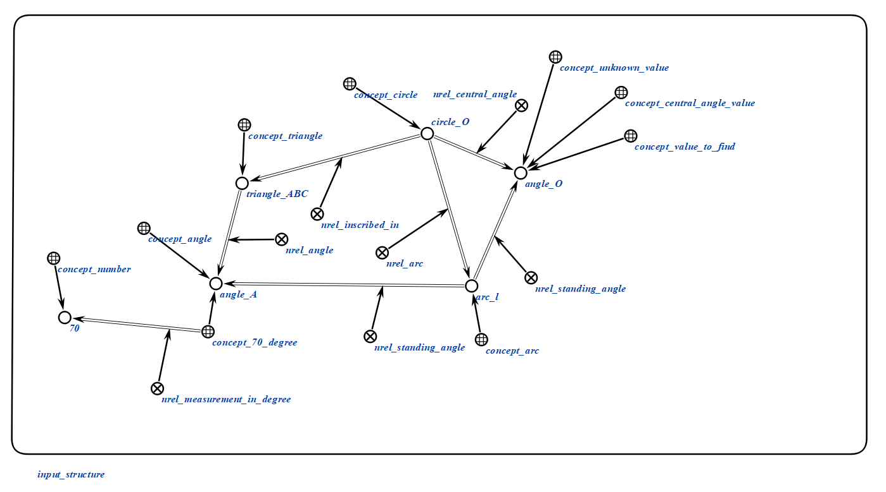
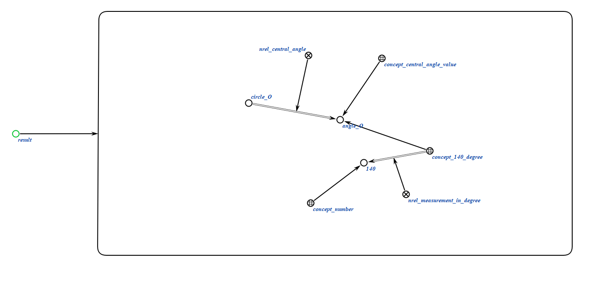
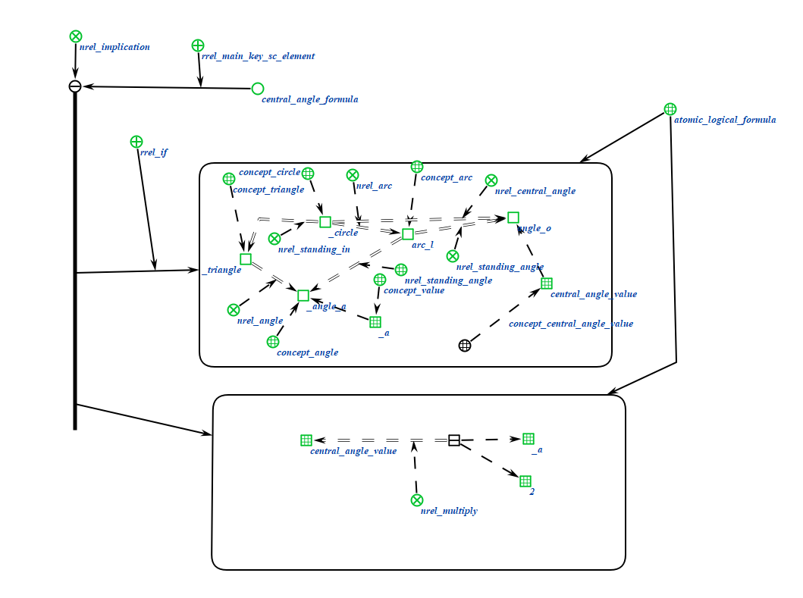

# Агент нахождения центрального угла

Это агент, который находит центральный угол, с помощью action_generate_values_expression и action_calculate_central_angle.

**Класс действия:**

`action_find_central_angle`

**Параметры:**

1. `Central_Angle_Addr` — sc-ссылка на центральный угол.

**Рабочий процесс:**

* Агент action_generate_values_expression создает структуру используя формулу, а второй агент action_calculate_central_angle считает центральный угол
### Пример

Пример входной структуры:

</img>

Пример выходной структуры:

</img>

### Логическое правило агента
</img>

### Результат

Возможные коды результата:
 
* `SC_RESULT_OK` — ответное сообщение сгенерировано;
* `SC_RESULT_ERROR` — внутренняя ошибка.

